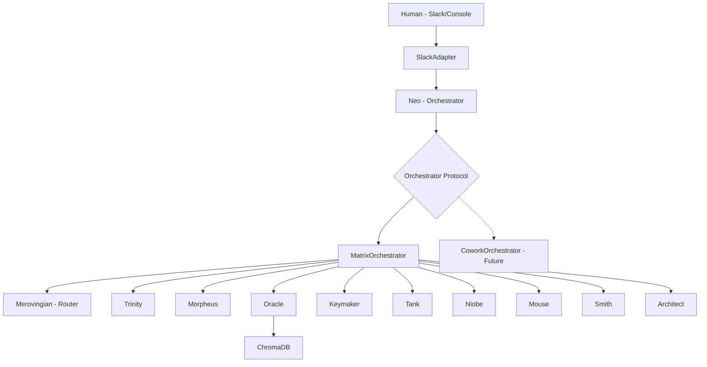

# The Matrix Agent Team

```
  ████████╗██╗  ██╗███████╗    ███╗   ███╗ █████╗ ████████╗██████╗ ██╗██╗  ██╗
  ╚══██╔══╝██║  ██║██╔════╝    ████╗ ████║██╔══██╗╚══██╔══╝██╔══██╗██║╚██╗██╔╝
     ██║   ███████║█████╗      ██╔████╔██║███████║   ██║   ██████╔╝██║ ╚███╔╝
     ██║   ██╔══██║██╔══╝      ██║╚██╔╝██║██╔══██║   ██║   ██╔══██╗██║ ██╔██╗
     ██║   ██║  ██║███████╗    ██║ ╚═╝ ██║██║  ██║   ██║   ██║  ██║██║██╔╝ ██╗
     ╚═╝   ╚═╝  ╚═╝╚══════╝    ╚═╝     ╚═╝╚═╝  ╚═╝   ╚═╝   ╚═╝  ╚═╝╚═╝╚═╝  ╚═╝
```

A multi-agent AI system themed after The Matrix. Eleven agents run inside a Docker environment called **Zion**, coordinated by a pluggable orchestration layer designed for future Claude COWORK migration.

## Agent Roster

| Agent | Role | Description |
|-------|------|-------------|
| **Neo** | Orchestrator | Receives user input, delegates to agents, presents results |
| **Trinity** | Executive Assistant | General tasks, summaries, drafts. Fallback agent |
| **Morpheus** | Coder | Code generation, review, debugging |
| **Oracle** | Research/RAG | Knowledge retrieval via ChromaDB vector store |
| **Keymaker** | APIs/Integrations | External service connections and webhooks |
| **Tank** | DevOps | Infrastructure, monitoring, container health |
| **Niobe** | Security | Vulnerability scanning, access control, code review |
| **Mouse** | Data | Data collection, cleaning, transformation |
| **Smith** | Testing/QA | Adversarial testing, edge cases, bug hunting |
| **Merovingian** | Task Router | Analyzes tasks and routes to appropriate agents (internal) |
| **Architect** | System Design | Architecture decisions, schema design, planning |

## Architecture



## Prerequisites

- **Docker Desktop** installed and running
- **Python 3.12+** (for local development)
- **AWS Bedrock access** via Instacart AI Gateway (or direct Bedrock credentials)

## Quick Start

1. **Clone and configure:**
   ```bash
   cd matrix-agents
   cp docker/.env.example docker/.env
   # Edit docker/.env with your ANTHROPIC_BEDROCK_BASE_URL
   ```

2. **Start Zion:**
   ```bash
   ./scripts/start_zion.sh
   ```

3. **Interact with Neo:**
   The console will start automatically. Type a task or use commands:
   ```
   You> Write a Python function to sort a list
   [Neo]: Routing to: Morpheus
   [Morpheus]: Here's a sorting function...
   ```

## CLI Commands

| Command | Description |
|---------|-------------|
| `/status` | Show status of all agents |
| `/agents` | List all agents with roles |
| `/health` | Run health checks |
| `/help` | Show available commands |
| `/quit` | Exit the Matrix |

## Development

### Running locally (without Docker):
```bash
python -m venv .venv
source .venv/bin/activate
pip install -r requirements.txt
cp docker/.env.example .env
python -m agents.neo
```

### Running tests:
```bash
pytest tests/ -v
```

### Adding a new agent:

1. Create `agents/your_agent.py` inheriting from `MatrixAgent`
2. Implement `async execute(self, task: dict) -> AgentResult`
3. Add prompt to `config/agent_prompts.yml`
4. Add identity to `config/agent_identities.yml`
5. Register in `agents/neo.py:build_registry()`

## Slack Setup

1. Create a Slack App at api.slack.com
2. Add Bot Token Scopes: `chat:write`, `chat:write.customize`, `channels:history`, `channels:read`
3. Install to workspace and copy Bot Token
4. Set `SLACK_MODE=slack`, `SLACK_BOT_TOKEN`, and `SLACK_CHANNEL_ID` in `.env`

## COWORK Migration

The orchestration layer is designed to be swapped for Claude COWORK:

- **Keep:** Agent identities, prompts, Slack adapter, Docker infra, config
- **Replace:** `orchestration/matrix_orchestrator.py` with `CoworkOrchestrator`
- **Swap point:** Set `ORCHESTRATOR_TYPE=cowork` in `.env`
